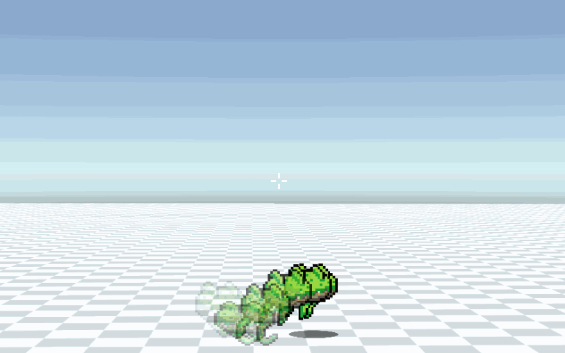

# After image for animated sprites

Use this script to create an after image effect on an animated sprite in Unity. 

There are two versions: 
- <b>AfterImage.cs</b> uses an enumerator to fade sprite.
- <b>AfterImageLeanTween.cs</b> replaces the enumerator with a tween using the LeanTween package.

Additionally, I'm using a separate script for sprite rotation so you can replace the one I use on line 51 if you are doing 2.5D.
